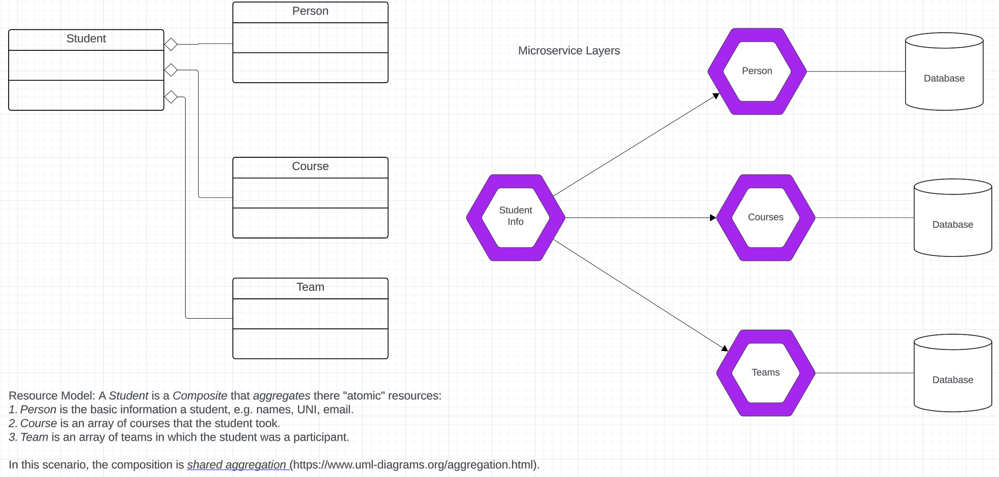

# Synchronous and Asynchronous REST APP Call

__Note:__ These example are in progress for _COMS W4153 -- Cloud Computing_ at Columbia University
for the Fall 2024 semester. These examples are not complete or totally correct.

This folder contains two example programs:
- [sync1](./sync1.py) calls a list of URLs one at a time, synchronously waiting on each call.
- [async1](./async1.py) calls a list of URLs "in parallel" 
using [asyncio](https://docs.python.org/3/library/asyncio.html) and
[aiohttp](https://docs.aiohttp.org/en/stable/)

Each URL in the list tested is of the form ```{"rel": "some linked resource", "href": "URL to link resource"}```. This
approach provides examples for implementing an operation on a resource in a
[composite microservice](https://en.wikipedia.org/wiki/Microservices#:~:text=In%20the%20context%20of%20software,referred%20to%20as%20composite%20services).
The composite implements its functions by aggregating/composing two or more microservice services, 
which are often atomic microservices.

The test provides basic insight into calling a composite microservice implementing the resource ```student_info``` that is
composite of resources ```person, courses``` and ```teams.```  The resource model and logical microservice architecture
view are:

|         |
|:------------------------------------------------:|
| __Resource Model and Microservice Logical View__ |


The sample output is:
```
{
  "courses": [
    {
      "course_id": "COMS1004",
      "semester": "Fall",
      "year": 2024,
      "_links": {
        "self": {
          "href": "/courses/COMS1004",
          "rel": "self"
        },
        "sections": {
          "href": "/courses/COMS1004/sections",
          "rel": "self"
        }
      }
    }
  ],
  "teams": [
    {
      "team_name": "Lions",
      "coach_name": "John Smith",
      "year_founded": 1990,
      "_links": {
        "self": {
          "href": "/teams/Lions",
          "rel": "self"
        }
      }
    }
  ],
  "person": {
    "uni": "ab1234",
    "last_name": "Doe",
    "first_name": "John",
    "middle_name": "M",
    "email": "john.doe@university.edu",
    "_links": {
      "self": {
        "href": "/persons/ab1234",
        "rel": "self"
      }
    }
  }
}
```

